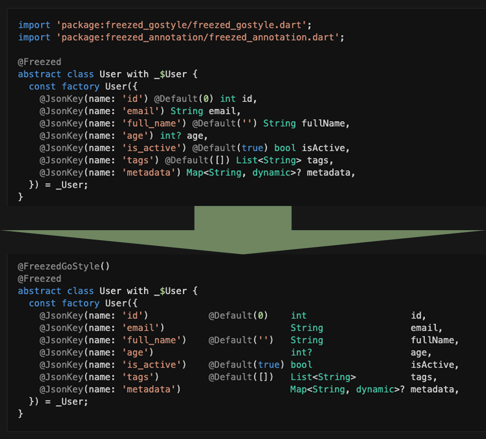

# Freezed GoStyle Formatter 🎨

<div align="center">
  
</div>

[](https://pub.dev/packages/freezed_go_style)

**A Dart formatter that applies Go-style alignment to Freezed models, making your code more readable and consistent.**

## Features

- ⚡ **Go-style alignment** - Beautiful column alignment for Freezed factory constructors
- 🎯 **Multiple annotations support** - Proper alignment of multiple annotations per field
- 🔄 **Automatic formatting** - Works seamlessly with `dart format` via CLI or VS Code extension
- ⚙️ **Zero configuration** - Just add `@FreezedGoStyle()` annotation

## Installation

Add to your `pubspec.yaml`:

```yaml
dev_dependencies:
  freezed_go_style: ^1.0.2
```

Or install globally:

```bash
dart pub global activate freezed_go_style
```

## Usage

### 1. Add annotation to your Freezed models

```dart
import 'package:freezed_annotation/freezed_annotation.dart';
import 'package:freezed_go_style/freezed_go_style.dart';

part 'user.freezed.dart';
part 'user.g.dart';

@FreezedGoStyle()  // Add this annotation
@freezed
class User with _$User {
  const factory User({
    @JsonKey(name: 'id')           @Default(0)    int                    id,
    @JsonKey(name: 'email')                       required String        email,
    @JsonKey(name: 'full_name')    @Default('')   String                 fullName,
    @JsonKey(name: 'age')                         int?                   age,
    @JsonKey(name: 'is_active')    @Default(true) bool                   isActive,
    @JsonKey(name: 'tags')         @Default([])   List<String>           tags,
    @JsonKey(name: 'metadata')                    Map<String, dynamic>?  metadata,
  }) = _User;

  factory User.fromJson(Map<String, dynamic> json) => _$UserFromJson(json);
}
```

### 2. Format your code

#### CLI

```bash
# Format a single file
dart run freezed_go_style -f lib/models/user.dart

# Format entire directory
dart run freezed_go_style -d lib/models/

# Verbose output
dart run freezed_go_style -f lib/models/user.dart -v
```

#### VS Code / Cursor Extension

Install the **Freezed GoStyle Formatter** extension:

1. Download from [VS Code Marketplace](https://marketplace.visualstudio.com/items?itemName=freezed-go-style.freezed-go-style) (coming soon)
2. Or install manually from `.vsix` file in the repository
3. Save your Dart file (Cmd+S / Ctrl+S) - formatting happens automatically!

The extension:
- Runs automatically after `dart format` on save
- Only processes files with `@FreezedGoStyle()` annotation
- Works seamlessly with your existing workflow

## How it works

**Before:**

```dart
@freezed
class User with _$User {
  const factory User({
    @JsonKey(name: 'id') @Default(0) int id,
    @JsonKey(name: 'email') required String email,
    @JsonKey(name: 'full_name') @Default('') String fullName,
  }) = _User;
}
```

**After:**

```dart
@FreezedGoStyle()
@freezed
class User with _$User {
  const factory User({
    @JsonKey(name: 'id')         @Default(0)  int             id,
    @JsonKey(name: 'email')                   required String email,
    @JsonKey(name: 'full_name')  @Default('') String          fullName,
  }) = _User;
}
```

## Configuration

No configuration needed! Just add the `@FreezedGoStyle()` annotation to classes you want to format.

## Requirements

- Dart SDK: `^3.10.4`
- Works with `freezed` and `freezed_annotation`

## Contributing

Contributions are welcome! Please feel free to submit a Pull Request.

## Support

- 📖 **Documentation**: [GitHub](https://github.com/Okladnoj/freezed_go_style)
- 🐛 **Issues**: [Issues](https://github.com/Okladnoj/freezed_go_style/issues)
- 📝 **Changelog**: [CHANGELOG.md](CHANGELOG.md)

## License

MIT License - see [LICENSE](LICENSE) file for details.
